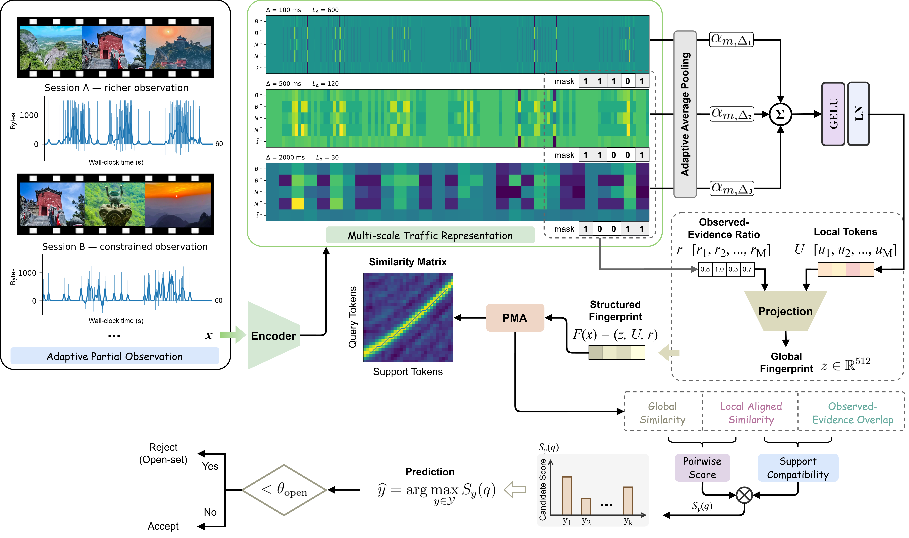

# VSTAMP

This repository implements **VSTAMP: Few-Shot Encrypted Video Recognition via Partial-Evidence Alignment under Adaptive Streaming** in Python and PyTorch.



- Abstract: Encrypted video recognition aims to identify streamed content from packet-level side-channel information without decrypting payloads. Existing few-shot methods typically assume that query and support sessions remain globally comparable after representation learning. Adaptive bitrate (ABR) streaming breaks this assumption: varying network conditions alter traffic patterns, effective content progress, and the amount of evidence exposed within a fixed observation window. Consequently, sessions of the same video can be temporally misaligned and only partially overlapping, making global embedding or prototype-based matching unreliable. We propose VSTAMP, a few-shot encrypted-video recognition framework that reformulates cross-condition recognition as a partial-evidence correspondence problem. VSTAMP first constructs structured multiscale traffic fingerprints that preserve both global identity cues and ordered local evidence. It then introduces partial monotone alignment to recover order-preserving correspondences under unequal progress rates and incomplete overlap, together with structured partial-view learning to supervise such correspondence without media timestamps. Finally, compatibility-marginalized matching adaptively aggregates heterogeneous support sessions according to their estimated overlap and aligned evidence. On the primary LongEnough and YDMS tasks, VSTAMP achieves 93.42\% and 92.02\% accuracy, respectively, exceeding the strongest evaluated adapted baselines by 4.52 and 3.70 percentage points. These results demonstrate that adaptive encrypted-video recognition is better modeled as partial correspondence than as conventional global distribution shift.

## Environment

- Python 3.10 or newer
- PyTorch 2.x
- CUDA-capable GPU recommended for 30,000-episode runs
- NumPy, Pandas, SciPy, scikit-learn, PyYAML, tqdm, matplotlib, tensorboard, dpkt, pytest

```shell
torch>=2.1
numpy>=1.24
pandas>=2.0
scipy>=1.10
scikit-learn>=1.3
PyYAML>=6.0
tqdm>=4.66
matplotlib>=3.7
tensorboard>=2.14
dpkt>=1.9.8
pytest>=7.4
```

Linux/macOS:

```bash
python -m venv .venv
source .venv/bin/activate
python -m pip install -r requirements.txt
```

Windows PowerShell:

```powershell
python -m venv .venv
.\.venv\Scripts\Activate.ps1
python -m pip install -r requirements.txt
```

Run commands below from the repository root.

## Data inputs

For a standalone, detailed guide covering official download links, supported schemas, manifests, preprocessing, validation, and Python loading, see [DATA_PROCESSING_README.md](DATA_PROCESSING_README.md).

### LongEnough

Use the undefended, offset-0, variable-bandwidth subset with 100 video directories and `bw1`, `bw2`, `bw4`, and `bw8` conditions. LongEnough uses on-wire packet length. Automatic discovery accepts `.pcap`, `.pcapng`, `.csv`, and `.npz` traces below the dataset root. For reproducible ABR-mode construction, the recommended interface is a `sessions.csv` at the dataset root.

### YDMS

The adapter recognizes the official measurement-directory layout containing `video_traffic.csv`, `application_data.csv`, and `stats_for_nerds.csv`. YDMS uses its native payload-length field. Duplicate sessions are removed, traces shorter than 60 seconds are excluded, and identities with fewer than 11 usable sessions are removed before the 96/38/58 identity split.

### Explicit session manifest

Use `sessions.csv` when a release uses different filenames or when direction/identity metadata cannot be inferred. Paths may be absolute or relative to the dataset root.

Required columns:

| Column | Meaning |
|---|---|
| `session_id` | Unique stable session identifier |
| `video_id` | Video identity |
| `trace_path` | PCAP, packet CSV, or packet NPZ |

Recommended columns:

| Column | Meaning |
|---|---|
| `bandwidth` | `bw1`, `bw2`, `bw4`, or `bw8` |
| `client_ip` | Required for PCAP or CSV files without an explicit direction column |
| `qoe_path` | Quality/application trajectory used only to construct ABR labels |
| `duplicate_group` | Common identifier for duplicate or near-duplicate traces |
| `abr_mode` | Existing evaluation-only mode label, if already supplied |
| `timestamp_scale` | Units per second in trace timestamps, for example `1000` for milliseconds |

Packet CSVs must contain a timestamp, packet length, and either direction or source/destination IP columns. Accepted direction values include `downstream`, `upstream`, `1`, and `-1`. NPZ traces use `timestamps`, `directions`, and `lengths`; direction is `+1` downstream and `-1` upstream.


## Preprocessing

LongEnough:

```bash
python scripts/prepare_longenough.py \
  --data-root /path/to/LongEnough-variable \
  --output-root data/processed/longenough
```

YDMS:

```bash
python scripts/prepare_ydms.py \
  --data-root /path/to/YDMS \
  --output-root data/processed/ydms
```

Preprocessing performs session extraction, 60-second filtering, duplicate control, identity-level splitting, Eq. (3) multiscale aggregation, `log(1+x)`, training-only normalization, and training-only ABR clustering. It writes:

- `sessions.csv`
- `splits.json`
- `normalization_stats.npz`
- `abr_cluster_model.pkl` and `abr_silhouette.json` when quality trajectories are available
- `features/<session_id>.npz`
- `preprocessing_manifest.json`

Cross-mode protocols require valid `qoe_path` or `abr_mode` metadata. Real-overlap evaluation additionally requires evaluation-only `media_start` and `media_end` values in each record's `extra` JSON, derived from player playback-progress and buffer logs.

Held-out bandwidth preparation excludes the selected condition from training identities' feature statistics and ABR fitting:

```bash
python scripts/prepare_longenough.py \
  --data-root /path/to/LongEnough-variable \
  --output-root data/processed/longenough_unseen_bw1 \
  --held-out-bandwidth bw1

python scripts/prepare_longenough.py \
  --data-root /path/to/LongEnough-variable \
  --output-root data/processed/longenough_unseen_bw8 \
  --held-out-bandwidth bw8
```

## Training

Single seed:

```bash
python scripts/train.py --config configs/longenough.yaml --seed 0
```

Three matched seeds:

```bash
python scripts/run_seeds.py --config configs/longenough.yaml --seeds 0 1 2
```

The default schedule is the paper protocol: 10-way, 2-shot, four queries per identity, AdamW, 30,000 optimizer steps, cosine decay from `1e-4` to `1e-6`, and validation every 500 episodes. `best.pt` is selected only by validation accuracy; test identities never select a checkpoint.

Each run is stored below:

```text
outputs/<dataset>/<experiment_name>/seed_<seed>/
  config.yaml
  training_log.csv
  train_episodes.jsonl
  metrics.json
  best.pt
  last.pt
```

## Evaluation

Example:

```bash
python scripts/evaluate.py \
  --config configs/longenough.yaml \
  --checkpoint outputs/longenough/full_vstamp/seed_0/best.pt \
  --protocol cross_mode \
  --seed 0
```

Supported protocols:

- `cross_mode`
- `same_mode`
- `balanced_3shot`
- `random_5shot`
- `cross_bandwidth`
- `bandwidth_pair` with `--support-bandwidth` and `--query-bandwidth`
- `query_truncation`
- `correspondence`
- `unseen_bandwidth`
- `open_set`
- `real_overlap`

Fixed episode definitions are persisted under the processed dataset's `episodes/` directory and reused for matching seeds and methods. Recognition evaluations write `metrics.json`, `episode_results.csv`, and `test_predictions.npz`. Query truncation writes `query_truncation.csv` and applies truncation to raw packet traces before aggregation.

For a 300-episode ordered-bandwidth diagnostic:

```bash
python scripts/evaluate.py --config configs/longenough.yaml \
  --checkpoint outputs/longenough/full_vstamp/seed_0/best.pt \
  --protocol bandwidth_pair --support-bandwidth bw1 --query-bandwidth bw8
```

Aggregate scalar metrics across seeds:

```bash
python scripts/aggregate_results.py outputs/longenough/full_vstamp
```

## Ablations and controls

All variants use configuration switches rather than copied model implementations.

```bash
python scripts/run_ablation.py --config configs/ablations/no_alignment_loss.yaml
python scripts/run_ablation.py --config configs/ablations/no_progress_warp.yaml
python scripts/run_ablation.py --config configs/ablations/global_only.yaml
python scripts/run_ablation.py --config configs/ablations/diagonal.yaml
python scripts/run_ablation.py --config configs/ablations/soft_dtw.yaml
```

Additional configs cover uniform scale fusion, no prefix transform, no supervised contrastive loss, PMA with prefix-only supervision, mean pair score, SupportMax, uniform LogSumExp, similarity-only responsibility, and overlap-only responsibility. Every trainable support-aggregation rule is optimized end to end with its own candidate score.

Select Soft-DTW smoothing using validation identities only:

```bash
python scripts/select_soft_dtw_gamma.py \
  --config configs/ablations/soft_dtw.yaml \
  --gammas 0.05 0.1 0.2 0.5 1.0
```

Sensitivity examples:

```bash
python scripts/run_sensitivity.py --config configs/longenough.yaml \
  --parameter tokens --values 15 20 30 40 60 --seeds 0 1

python scripts/run_sensitivity.py --config configs/longenough.yaml \
  --parameter gap_penalty --values 0 0.05 0.10 0.20 0.40 --seeds 0 1

python scripts/run_sensitivity.py --config configs/longenough.yaml \
  --parameter lambda_z --values 0 0.25 0.50 0.75 1.0 --seeds 0 1
```

## Runtime benchmark

The default command uses 100 warm-up iterations and 1,000 measured FP32 iterations at batch size one. Support fingerprints are precomputed and matching scores ten supports for a complete 5-way 2-shot query.

```bash
python scripts/benchmark.py \
  --config configs/longenough.yaml \
  --checkpoint outputs/longenough/full_vstamp/seed_0/best.pt
```

## Verification

```bash
python -m compileall vstamp scripts
pytest -q
python scripts/prepare_longenough.py --help
python scripts/prepare_ydms.py --help
python scripts/train.py --help
python scripts/evaluate.py --help
python scripts/benchmark.py --help
```

The PMA tests verify batched shapes, diagonal and shifted correspondence, partial validity, finite nonnegative mass, explicit reverse recursion against an autograd reference with error below `1e-5`, and finite gradients through the correspondence mass.
